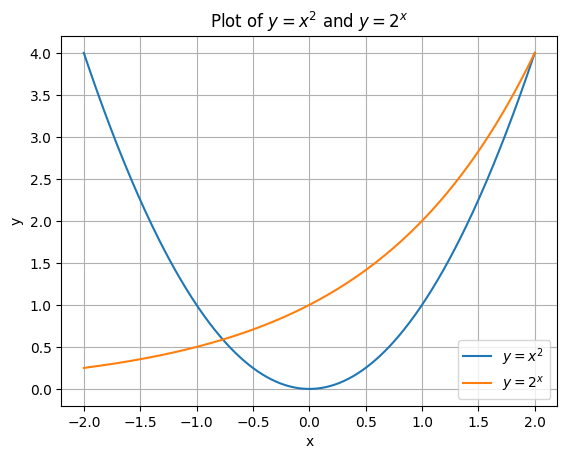

# Assignment 02

You are expected to submit this assignment as a github repo. 

* Create a new github repository. You may call it `fcp-assignment2`. Please make sure you make this repository public. 

* Please [download this notebook][1] and add it to your repository.

* Solve all the problems in the notebook and commit them to the repository. 

The instructions for submitting your assignment will be shared with you by email.

[1]: https://raw.githubusercontent.com/anandology/isi-fcp/refs/heads/main/assignments/assignment-02.ipynb

Please solve the problems in the empty cells provided below the problem statement.

Some of the problems require input files. In those cases, sample input files provided after the problem. 

Please `Run All Cells` to execute all the cells and create the required files before you start solving the problems. Please note that you just need to do that only once.

## Problem 1: Digit Count

Write a function `digit_count` that takes a number and a digit as argument and returns the number of times the digit is present in that number.

```python
>>> digit_count(1231, 1)
2
>>> digit_count(1231, 3)
1
>>> digit_count(1231, 9)
0
```

**Hint:**

```python
>>> "mathematics".count("mat")
2
```


```python
def digit_count(number, digit):
    return str(number).count(str(digit))
digit_count(1231, 1)
```


    2


## Problem 2: Despace

Write a function `despace` to remove all the spaces from a string.

```python
>>> despace("hello world")
'helloworld'
>>> despace("a b c d e")
'abcde'
>>> despace("pi seconds is a nano century")
'pisecondsisananocentury'
```


```python
def despace(text):
    return ''.join(text.split())
despace('  hell\to   \nworld  ')
```


    'helloworld'


## Problem 3: Reverse Words
Write a function `reverse_words` that takes a sentence and returns a new sentence with all the words in the reserse order.

```
>>> reverse_words("joy of programming")
'programming of joy'

>>> reverse_words("less is more")
'more is less'

>>> reverse_words("road goes ever on and on")
'on and on ever goes road'
```

Please note that only the order of the words in the sentence is reversed, not the letters in each word.


```python
def reverse_words(text):
    return ' '.join(text.split()[::-1])
reverse_words('he llo w orld')
```


    'orld w llo he'


## Problem 4: Multiple of 3 and 5

If we list all the natural numbers below that are multiples of `3` or `5`, we get `3`, `5`, `6`, and `9`. The sum of these multiples is `23`.

Write a python program to compute the sum of all the multiples of `3` or `5` below `1000`.
 
Credits: This problem is based on [Problem 1 of Project Euler](https://projecteuler.net/problem=1).


```python
print(sum(map(lambda x: x if x % 3 == 0 or x % 5 == 0 else 0,range(1000))))
```

    233168


## Problem 5: Generate Password

Write a function `generate_password` to generate random password of given length.

The function should take length `n` as argument and generate a password using mix of letters from lowercase, uppercase from English alphabet and digits. It should not have any other characters.

```
>>> generate_password(8)
'rBZLcP8V'
>>> generate_password(25)
'JU938tUT36QRvVEPh9OLrxlrB'
```

**Hint**

* See `random.choice` function from the `random` module
* See `string.ascii_letters` and `string.digits` from the string module


```python
import random, string
def generate_password(n):
    return ''.join(random.choices(string.ascii_letters + string.digits, k = n))
generate_password(100)
```


    'wuS0WtlEzzrFgJkeXV4MwnHf4P8NjRusDL93cH52AAcptbYMDa4HGmr1iEk23yZA4gACGXULQE0fEzKteit7YVWt4ZxjpWfXDwCX'


## Problem 6: Fortune

`fortune` is popular program on Unix that displays a random message from a database of quotations. These  quotes are often funny and witty. 

Your task is a implement a simpler version of the _fortune_ command. Write a program `fortune.py` that prints a random quote from `fortune.txt` file. The file contains quotes separated by `%`. A sample `fortune.txt` is provided below.

This is how it is suppose to work.

```
$ python fortune.py
You are taking yourself far too seriously.

$ python fortune.py
It usually takes more than three weeks to prepare a good impromptu speech.
                -- Mark Twain
```

**Hint:**

Python has a built-in module `random`. It can be used to pick a random item from a list of items.

```python
>>> import random
>>> names = ["alice", "bob", "charlie", "dave"]
>>> random.choice(names)
'charlie'
>>> random.choice(names)
'alice'
```


```python
%%file fortune.txt
You will soon forget this.
%
Too much is just enough.
                -- Mark Twain, on whiskey
%
Q:      Why did the astrophysicist order three hamburgers?
A:      Because he was hungry.
%
You will be aided greatly by a person whom you thought to be unimportant.
%
Communicate!  It can't make things any worse.
%
It usually takes more than three weeks to prepare a good impromptu speech.
                -- Mark Twain
%
Write yourself a threatening letter and pen a defiant reply.
%
You should go home.
%
You are taking yourself far too seriously.
%
Q:      Do you know what the death rate around here is?
A:      One per person.
%
You need no longer worry about the future.  This time tomorrow you'll be dead. 
```

    Overwriting fortune.txt


```python
%%file fortune.py
print(__import__('random').choice(open('fortune.txt').read().split('%')))
```

    Writing fortune.py


```python
!python fortune.py
```

    
    Write yourself a threatening letter and pen a defiant reply.
    


## Problem 7 : Countdown

Write a program `countdown.py` to print numbers from `n` to 1.

The program should take the number `n` as command-line argument.

```
$ python countdown.py 5
5
4
3
2
1
```


```python
%%file countdown.py
print("\n".join(map(str, list(range(int(__import__('sys').argv[1]), 0, -1)))))
```

    Writing countdown.py


```python
!python countdown.py 10

```

    10
    9
    8
    7
    6
    5
    4
    3
    2
    1


## Problem 8: Largest Number in a File

Write a function `largest_number_in_file` that takes a name of a file containing numbers as an arguments and returns largest number in that file.

```
>>> largest_number_in_file("5.txt")
5
>>> largest_number_in_file("numbers.txt")
42
```

The sample input files are provided below.

**Hint:**

The built-in function `max` takes a list a numbers as arguments and returns the maximum among them.


```
>>> max([1, 2, 3, 4, 5])
5
```


```python
%%file 5.txt
1
2
3
4
5
```

    Overwriting 5.txt


```python
%%file numbers.txt
1
16
12
37
42
19
9
15
18
24
```

    Writing numbers.txt


```python
def larges_number_in_file(filename):
    print(max(map(int,open(filename).readlines())))
```


```python
larges_number_in_file('numbers.txt')
```

    42


## Problem 9: Plot $y = x^2$ and $y = 2^x$

Write a python program to plot $y = x^2$ and $y = 2^x$ in the range $[-2, 2]$. Both the plots should appear in the same graph and add legend to label the plots. Please use latex math expressions for the labels to write $x^2$ and $2^x$.


```python
import numpy as np
import matplotlib.pyplot as plt

x = np.linspace(-2, 2, 400)
y1 = x**2
y2 = 2**x

plt.plot(x, y1, label=r'$y = x^2$')
plt.plot(x, y2, label=r'$y = 2^x$')
plt.xlabel('x')
plt.ylabel('y')
plt.title('Plot of $y = x^2$ and $y = 2^x$')
plt.legend()
plt.grid(True)
plt.show()

```


    

    


## Problem 10: Manhattan Distance

Write a function `manhattan_distance` to compute the manhattan distance between two vectors.

The manhattan distance is defined as:

$M(p, q) = \sum_{i=1}^{n}{| p_i - q_i |}$

For more info see: https://en.wikipedia.org/wiki/Taxicab_geometry

```
>>> manhanttan_distance(np.array([0,0]), np.array([3, 4]))
7
```


```python
import numpy as np
```


```python
def manhanttan_distance(x: np.array,y: np.array): 
    return np.sum(np.abs(x - y))
```


```python
manhanttan_distance(np.array([0,0]), np.array([3, 4]))
```


    7


